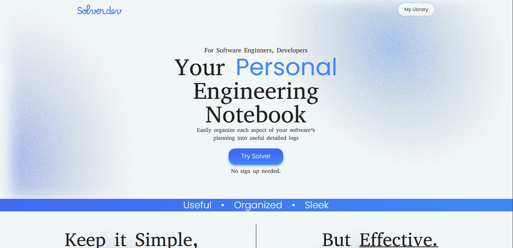
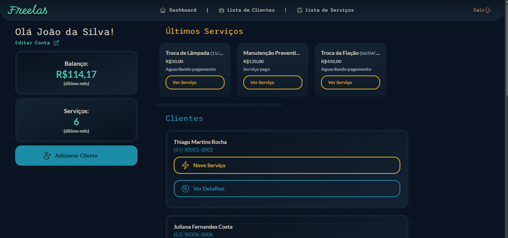

<h1>  
Hi there 👋
</h1>

```
------------------------
| I'm Flávio Betarelli |
------------------------ 
A Fullstack Web Developer, and aspiring Software Engineer from Brazil.
```
<h2>
    🎓 Education
</h2>


* **Associate Degree in Systems Analysis and Development** | FATEC Indaiatuba *(In Progress)*
* **Technical Certificate in Web Development** | IFSP Salto *(Completed)*

<h2> 
👨‍💻 My Stack
</h2>

```typescript
const stack: MyStack = {
    'languages': {
            'primary': ['Javascript','Typescript']
            'secondary': ['Java with Spring','SQL']
        }
    'frontend': [
    'React Vite', 'TailwindCSS', 'React Router'
    ]
    'backend': [
    'Express', 'JPA', 'SpringBoot'
    ]
} 
```

<h2> 
💻 Favorite Projects
</h2>

### 📝 Solver.dev

_"A React Vite application for documenting personal projects made for software engineers. Register design and development decisions in a simple, intuitive way, with a 100% local scope."_

[Check it out Here!](https://github.com/fbetarelli/Solver.dev)



### 💼 Freelas

_"An all-in one manager for freelance workers to track, organize and visualize their clients, jobs, payments and more."_

[Check it out Here!](https://github.com/fbetarelli/Freelas-Freelance-Manager)

